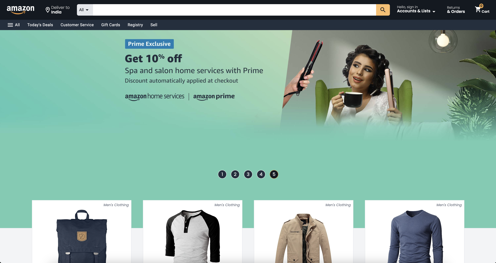
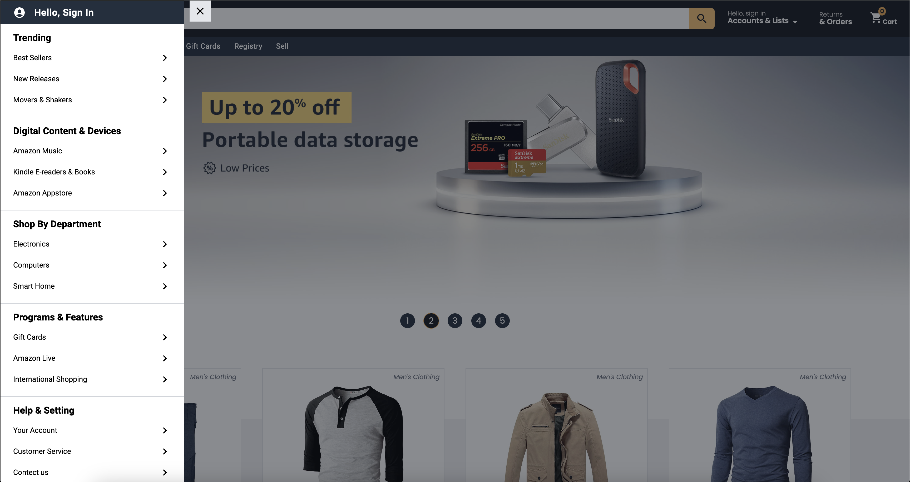
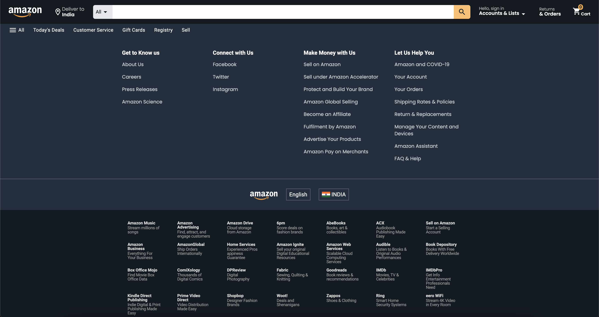
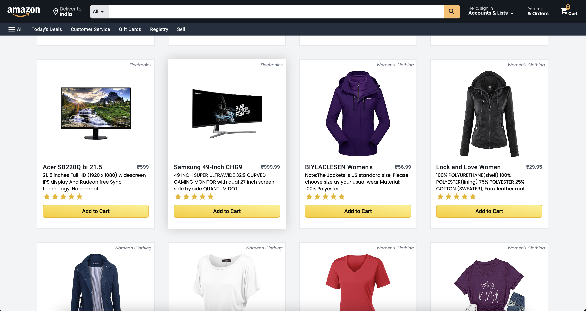
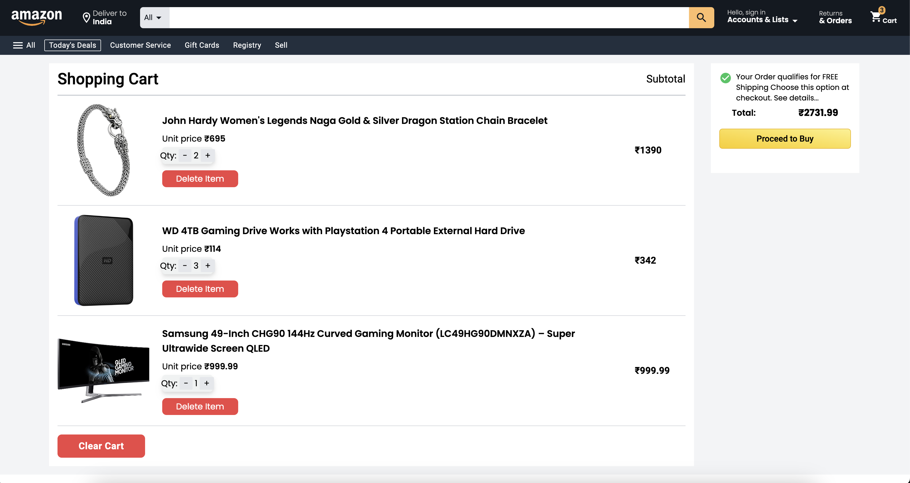
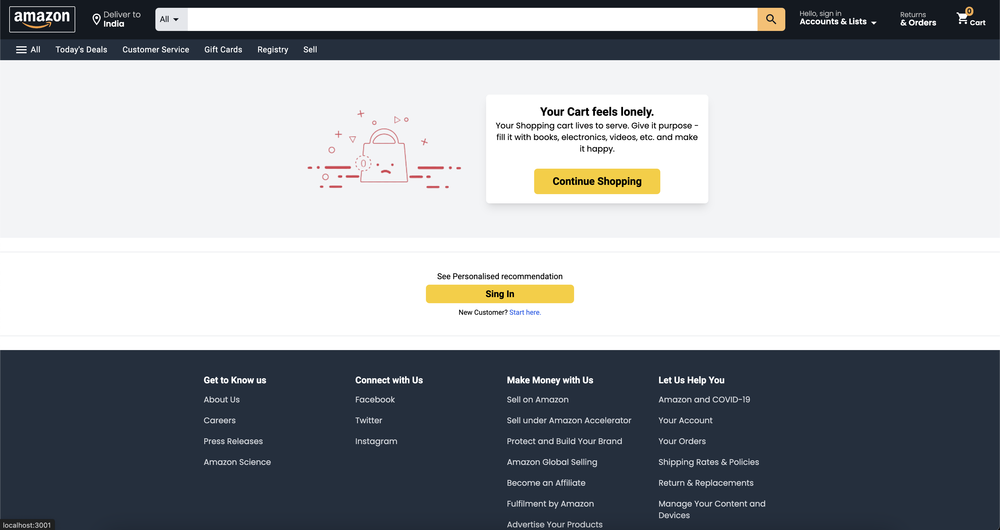
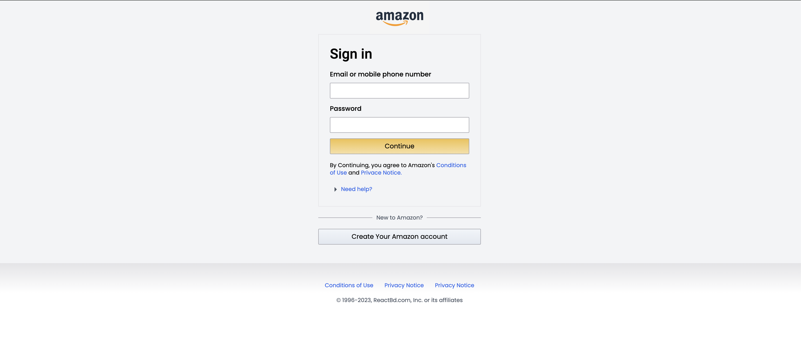
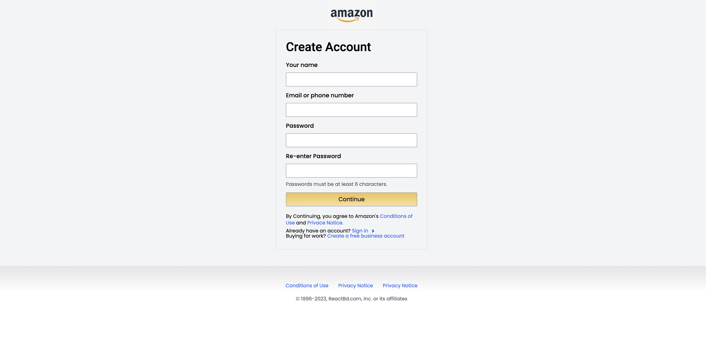
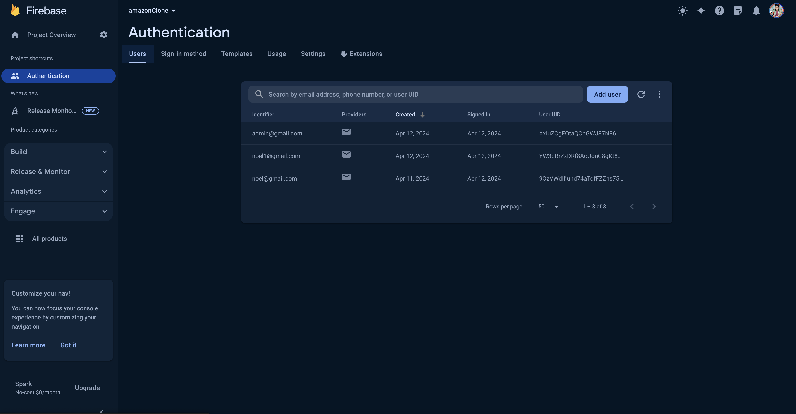

# Amazon Clone

### Overview
This project is a frontend replica of the popular e-commerce platform Amazon, built using React.js. The goal of this project is to demonstrate my proficiency in React.js development, including component-based architecture, state management, and integration with external APIs.

### Features
* Product listings with images, titles, prices, and ratings.
* Search functionality to filter products based on keywords.
* User authentication and authorization.
* Cart management, allowing users to add/remove items.
* Responsive design for optimal viewing on various devices.

### Technologies Used
* __React.js:__ Frontend library for building user interfaces.
* __React Router:__ For routing and navigation within the application.
* __Firebase:__ Backend services for authentication and database management.
* __Stripe API:__ Secure payment processing for transactions.
* __HTML & CSS:__ Markup and styling for the application's UI.

### Acknowledgements
* The project was inspired by Amazon's UI and functionality.
* Special thanks to the React.js community for their valuable resources and tutorials.

### Hosted Link
https://amazon-clone-react-three-blush.vercel.app/

## ScreenShort

1. __Home Page__

* Home page Navbar contain:-
>* Material-Icon
>* Amazon Logo
>* Search Bar

2. __Side Bar__

* Side Bar contains:-
>* User Name
>* Products Category 

3. __Footer Section__

* Footer contains:-
>* Details
>* Category
>* Help
>* Recources

4. __Products Section__

* Product Section contains:-
>* All the Products Cart
>* Products Image
>* Products Type
>* Products Title
>* Products Description
>* Products Price
>* Add to Cart Button

5. __Cart Page__

* Cart Section contains:-
>* All the Products Added to Cart
>* Product Info
>* Quantity of items 
>* increase Quantity
>* Decrease Quantity
>* Products Price
>* Delete Button

6. __Empty Cart Section__

* Empty Cart Section:-
>* No Production Shown
>* Contine Shopping Button will redirect to Home Page.
>* Sign in Button to redirect to sign in page

7. __Signin Page__

* Sign in Page
>* React-Redux
>* Verify User Email & Password
>* Button to Create New User

8. __Signup Page__

> Sign up Page
>* Registration of a New User with Name, Email & Password
>* Existing Email id will give error

9. __Firebase__

* Firebase Section
>* Create a New User
>* Delete User
>* Store User Data
